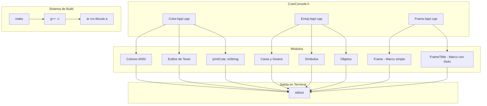

README.md creado exitosamente para **CuteConsole**. 

El archivo incluye:
- Badges de shields.io (C++98, Static Library, ANSI Colors, Cross-Platform)
- Descripción tipo elevator pitch
- Features extraídas del código (colores ANSI, estilos de texto, 50+ emojis organizados, marcos decorativos)
- Stack tecnológico con tabla
- Decisión técnica explicando la elección de C++98, namespaces y librería estática
- Diagrama Mermaid mostrando la arquitectura modular
- Guía de instalación con comandos `make` y ejemplo de uso
- Estructura del proyecto
- Sección de contacto
ecer la salida de terminal mediante colores ANSI, emojis y marcos decorativos. Proporciona una API simple e intuitiva para transformar interfaces de consola en experiencias visuales más atractivas y legibles.

## Características Principales

- **Sistema de Colores ANSI**: 16 colores de texto y 16 colores de fondo (básicos y brillantes)
- **Estilos de Texto**: Negrita, cursiva, subrayado, parpadeo, invertido y oculto
- **Emojis Organizados**: 50+ emojis predefinidos categorizados en caras, gestos, símbolos, objetos y naturaleza
- **Marcos Decorativos**: Funciones para enmarcar texto con bordes simples o títulos elegantes
- **Utilidades Integradas**: Funciones auxiliares como `printCute()` y `toString()`
- **Modular por Namespaces**: Organización limpia mediante `Color::`, `Emoji::` y `Frame::`

## Stack Tecnológico

| Categoría | Tecnología |
|-----------|------------|
| Lenguaje | C++98 |
| Sistema de Build | Makefile |
| Tipo de Librería | Estática (.a) |
| Dependencias | Solo STL (iostream, string, sstream) |

## Arquitectura y Decisiones Técnicas

CuteConsole adopta el estándar **C++98** para garantizar máxima compatibilidad con entornos legacy y sistemas con compiladores antiguos. La arquitectura modular basada en **namespaces** permite a los desarrolladores incluir únicamente los componentes necesarios, evitando overhead innecesario. El empaquetado como **librería estática** simplifica la integración en proyectos existentes: basta con enlazar el archivo `.a` sin dependencias externas adicionales.

La separación en módulos (`Color`, `Emoji`, `Frame`) sigue el principio de responsabilidad única: cada componente gestiona un aspecto distinto de la presentación en terminal, facilitando el mantenimiento y la extensibilidad del código.



## Instalación

### Requisitos

- Compilador C++ (g++ o clang++)
- Make

### Compilar la Librería

```bash
# Clonar el repositorio
git clone https://github.com/samuelhm/cute_console.git
cd cute_console

# Compilar la librería estática
make
```

### Integrar en tu Proyecto

```cpp
#include "CuteConsole.h"

int main() {
    // Usar colores
    std::cout << Color::red << "Texto en rojo" << Color::reset << std::endl;
    
    // Usar emojis
    std::cout << Emoji::rocket << " Despegando..." << std::endl;
    
    // Usar marcos
    Frame::Frame("Mensaje simple", Color::green);
    Frame::FrameTittle("Título Elegante", Color::cyan);
    
    return 0;
}
```

```bash
# Compilar tu proyecto enlazando la librería
g++ -std=c++98 main.cpp -I./cute_console/inc -L./cute_console -lcute -o myprogram
```

### Limpiar Archivos de Build

```bash
make fclean  # Elimina objetos y librería
make re      # Recompila desde cero
```

## Estructura del Proyecto

```
cute_console/
├── inc/
│   └── CuteConsole.h      # Header principal
├── src/
│   ├── Color/
│   │   ├── Color.hpp
│   │   └── Color.cpp
│   ├── Emoji/
│   │   ├── Emoji.hpp
│   │   └── Emoji.cpp
│   └── Frame/
│       ├── Frame.hpp
│       └── Frame.cpp
└── Makefile
```

## Contacto

| Plataforma | Enlace |
|------------|--------|
| GitHub | [github.com/samuelhm](https://github.com/samuelhm/) |
| LinkedIn | [linkedin.com/in/shurtado-m](https://www.linkedin.com/in/shurtado-m/) |